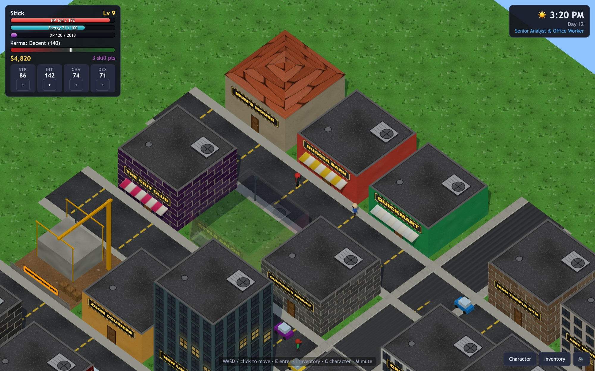
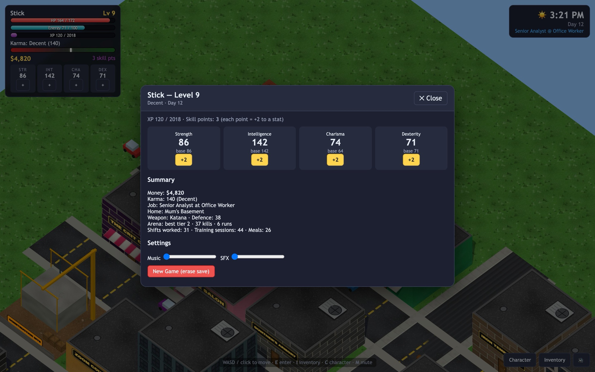
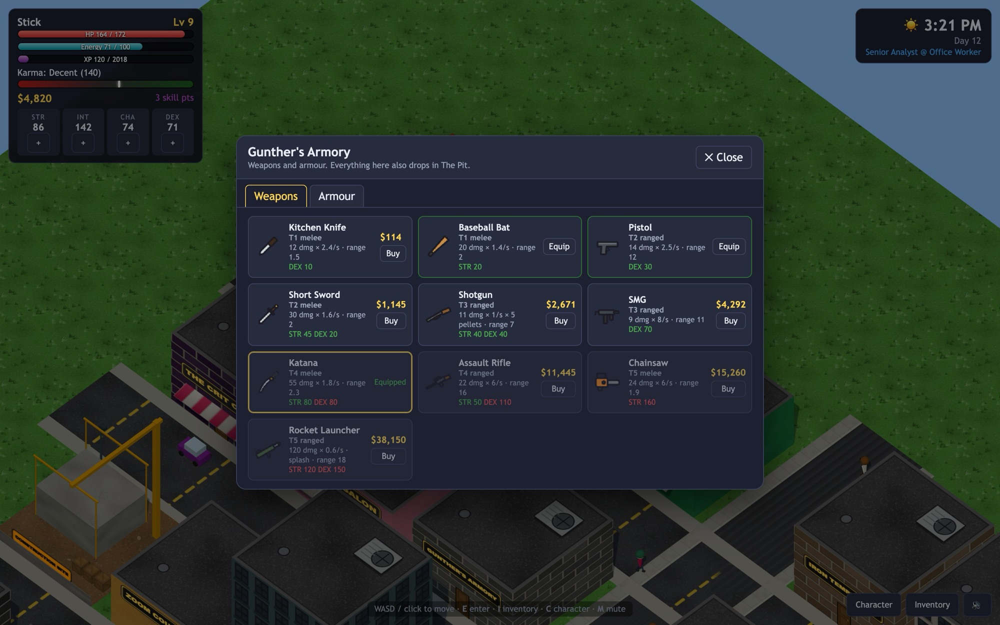
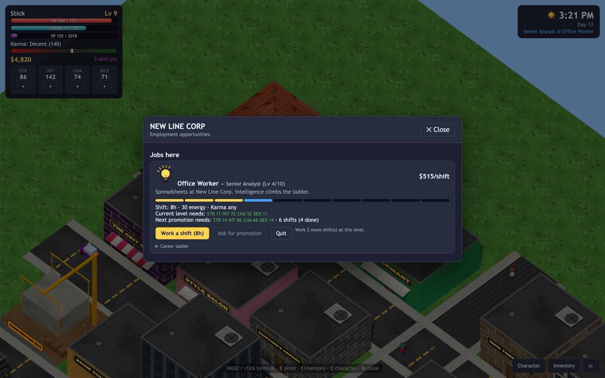
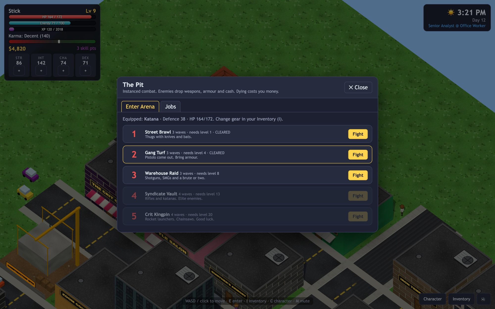
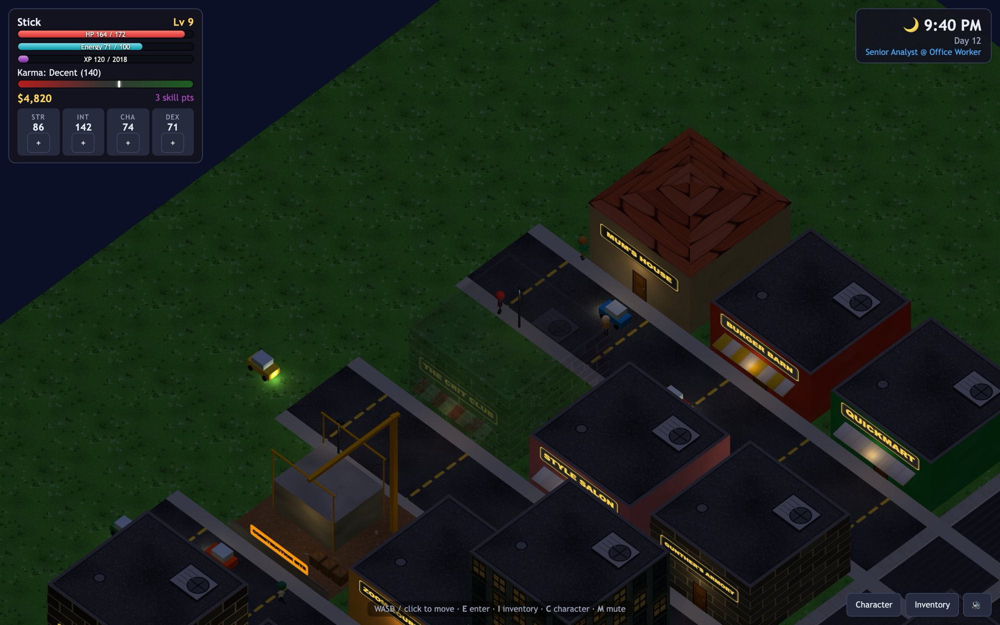
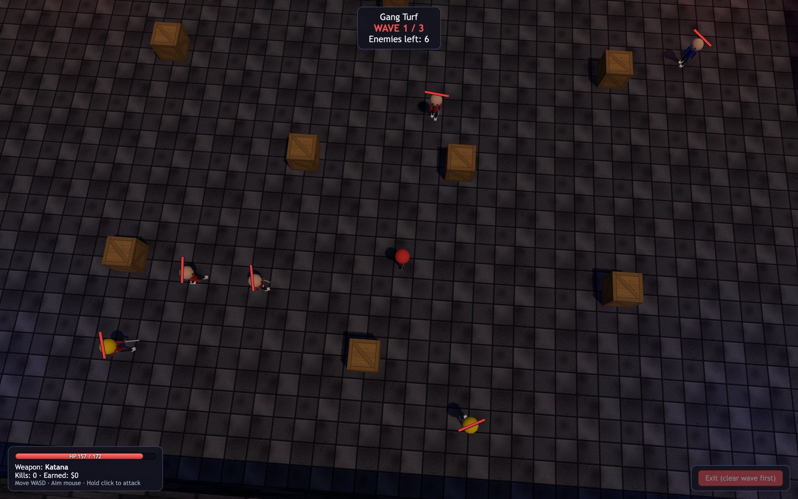
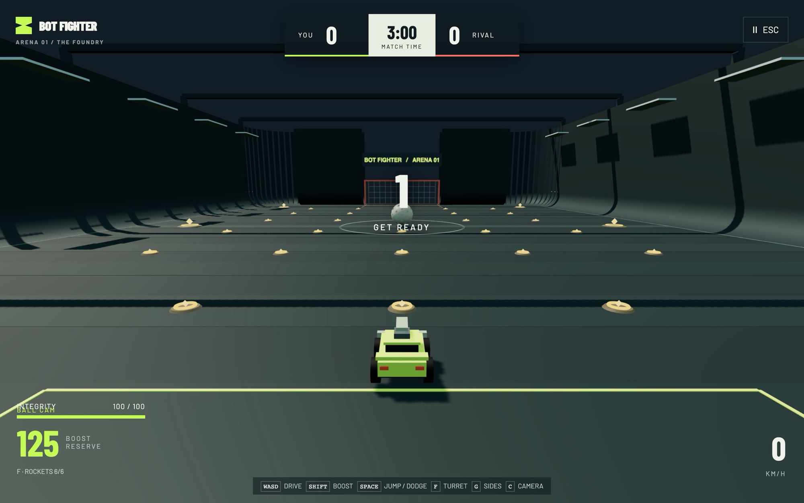
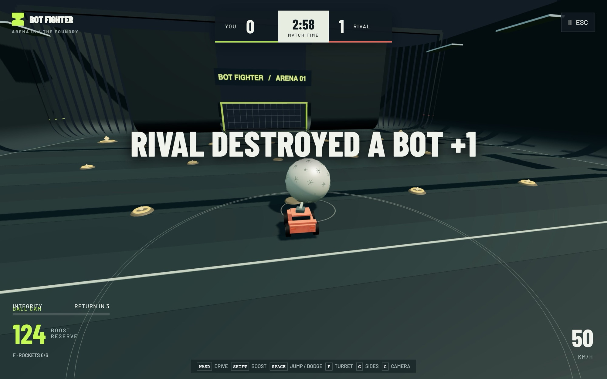
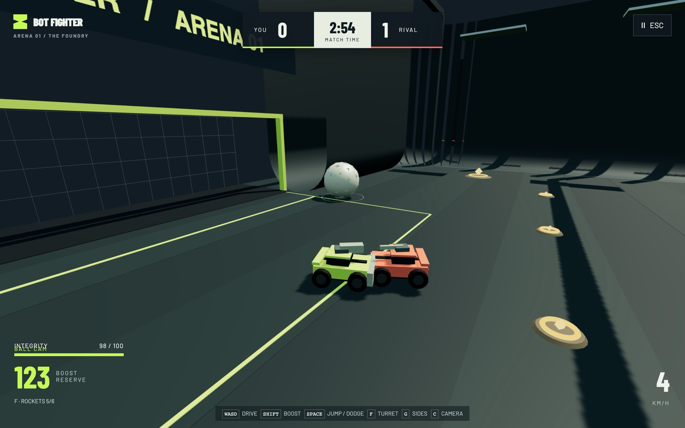

The first week was about finding out what a coding agent can build when you let it run in the background: pick a game, clone it in Three.js, test it locally, then keep iterating and pass it around.

## CritRPG

Monday's clone was Stick RPG 2: a stick-figure life sim where you work, train, fight and eventually buy the mansion. The constraint I set was **no asset files at all**. Every texture is painted on a canvas at runtime, every building and character is built from primitives, and every sound and music track is synthesised with the Web Audio API.

It went further than a clone needed to: 13 jobs with ten promotion levels each, four trainable stats, karma that locks some jobs out in both directions, five homes with renovations, and a clock where everything you do costs time.

Lighting, windows and fog follow the hour, so the city at night looks completely different:

## Bot Fighter, first pass

For Thursday I wanted something with a proper design behind it, so I wrote a brief before any code: *Robot Rage's garage bolted onto Rocket League's chassis.* Two armed cars, one oversized ball. You score 3 for a goal and 1 for a kill.

The brief put handling first. If the car isn't fun to drive with nothing bolted on, nothing else matters. So the first pass is mostly the car: a 120 Hz physics tick, boost, jump, dodge and air control, plus a garage where a 1,000-credit budget buys chassis upgrades and weapons for three hardpoints.

Everything here is procedural: boxy cars, a flat grey arena, no characters yet. That's what next week was for.

<!-- Playtest notes: who played it, what they said, what changed because of it. -->

## Next

- Put Bot Fighter in a git repo and deploy it somewhere people can play it.
- Plan three improvements properly (what, why, spec) before building them, then playtest each one.
