## Bot Fighter, second pass

The first pass proved the car was fun to drive. The second pass was about giving it a personality. The game is now live at [ngoochi.github.io/bot-fighter](https://ngoochi.github.io/bot-fighter/). It needs a keyboard or a gamepad.

The biggest change is **drivers**. There are five, each with a generated 90s-comic portrait, a 3D figure that stands on the garage turntable, a bio, a bank of taunts, and an ultimate that charges over the match:

- **Brick Hornaday**, a rhino with a doctorate. *Stampede:* triple mass and ram damage.
- **Bolt-9**, a refurbished arcade robot. *Overclock:* triple fire rate, no overheating.
- **Kira Moonblade**, an assassin. *Shadow Clone:* an AI copy of your car fights beside you.
- **Slick Ricky**, a chameleon hustler. *Triple Play:* the ball splits into three.
- **DJ Iceburg**, a penguin DJ. *Slow Jam:* your rival crawls at half speed.

The key art, weapon meshes, floodlight towers and textures were generated with a Runchat workflow. The cars and the arena are still procedural.

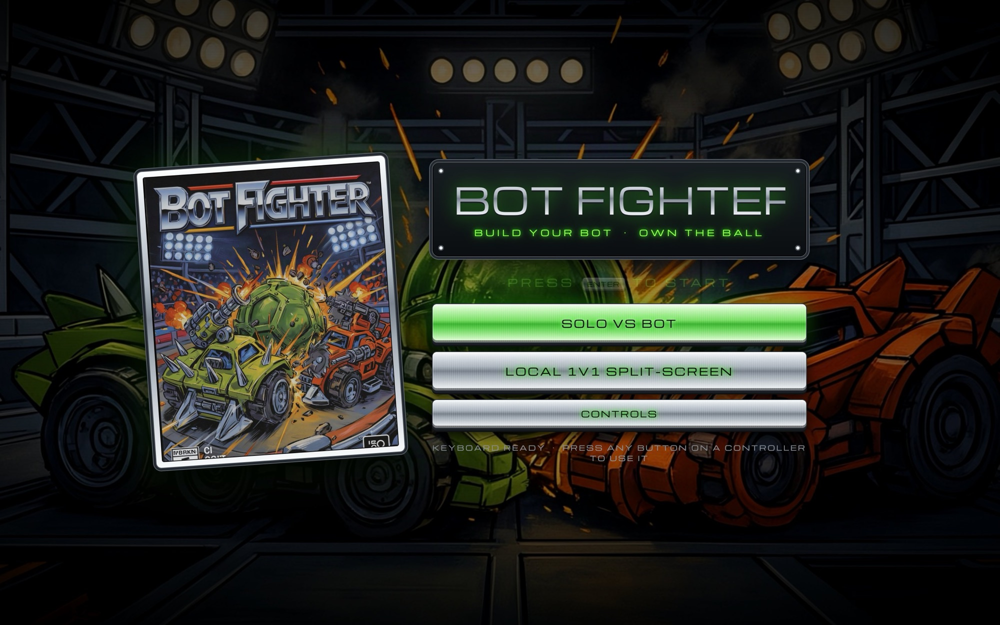

Here are the two garages side by side, six days apart:

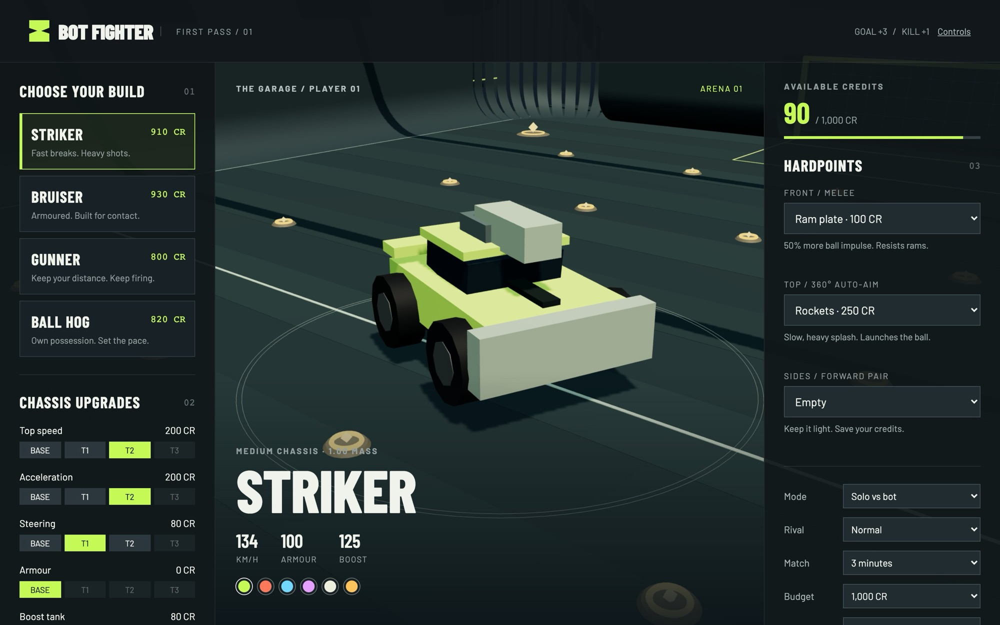
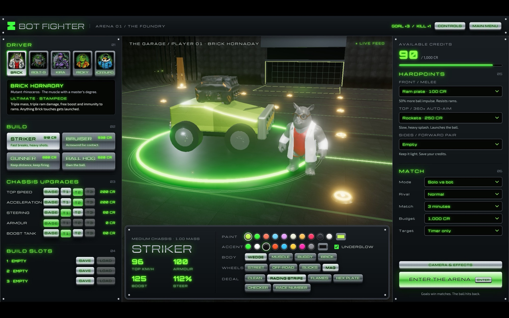

The other half of the pass was **combat feedback**, because in the first version it was hard to tell whether you were hitting anything. Now there are floating health bars over every car, hit markers, damage numbers, a lock-on reticle that goes from tracking to locked, and an *INCOMING LOCK* warning when the rival has you.

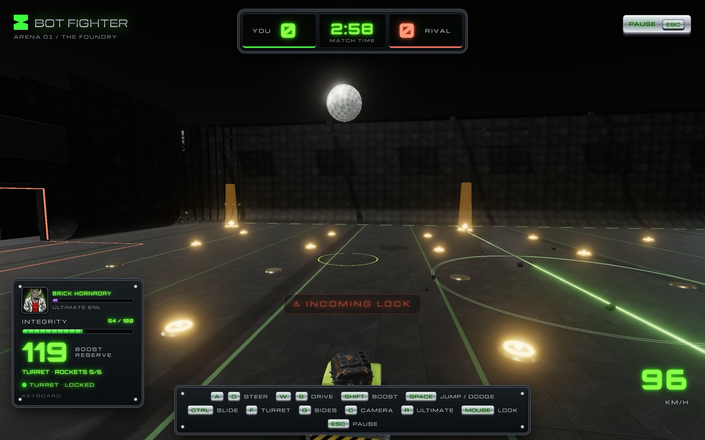
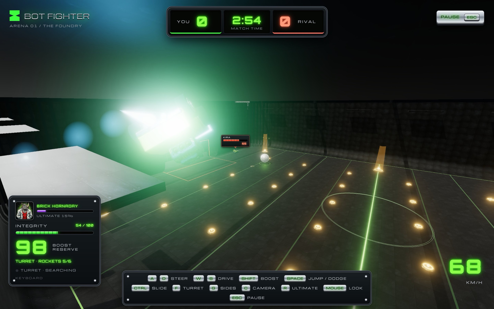

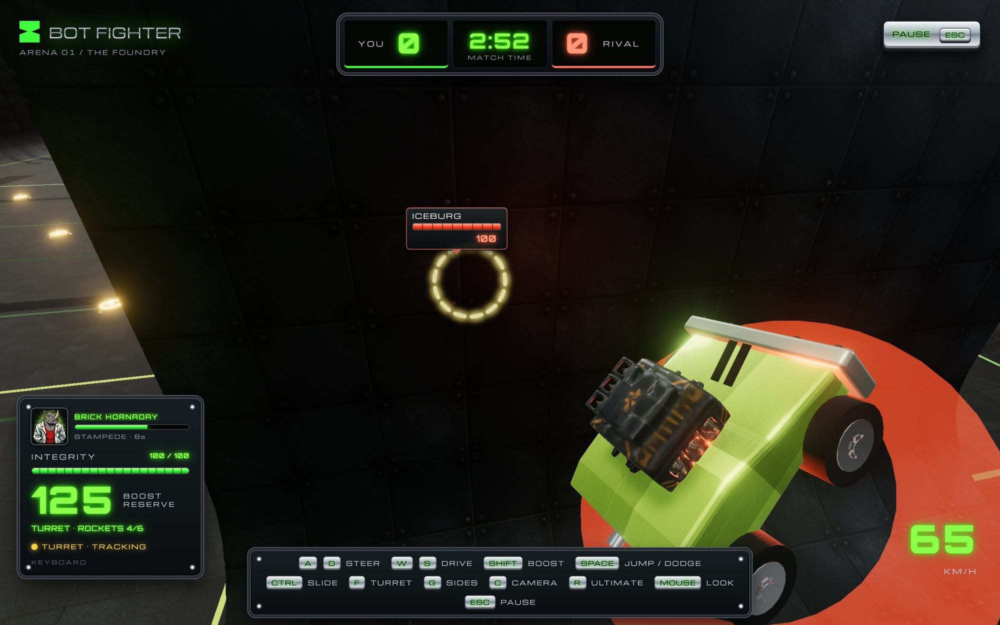
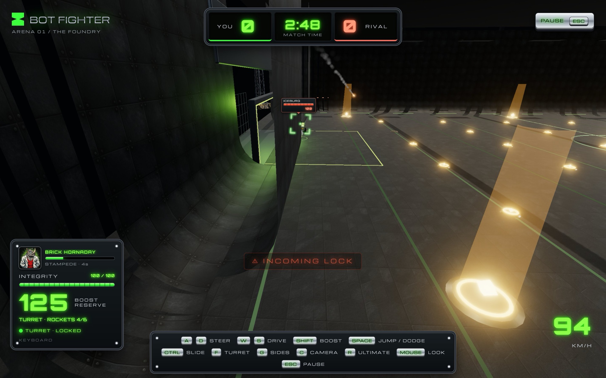

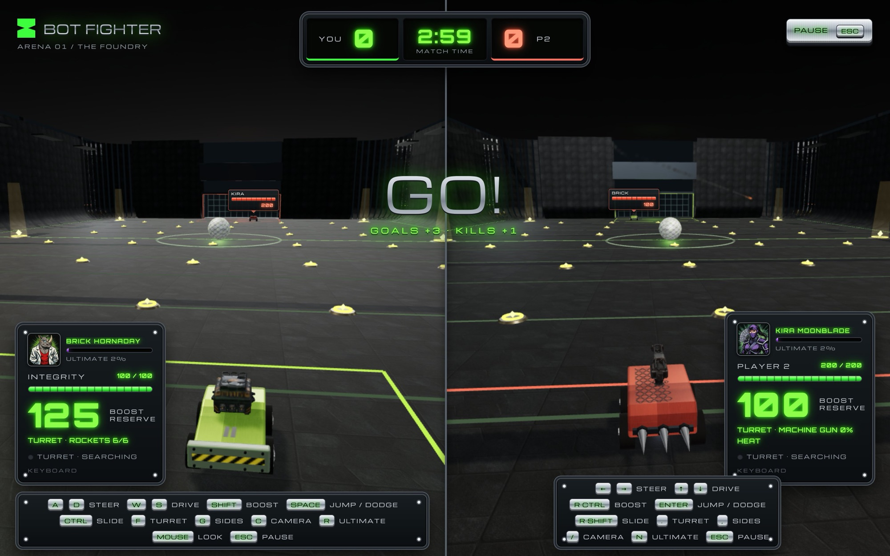

## TasteLens

The MVP brief for this week was a real app, with a database and a deploy. TasteLens is "Pinterest and Miro, but not crap": a taste trainer that learns your eye from quick A/B picks between buildings, then shows you what it thinks you like, in words.

It all runs in the browser. CLIP embeddings come from transformers.js, preferences are fitted with a Bradley–Terry model, and each next pair is picked to be as informative as possible. The first load downloads the model once and pulls a seed library of openly licensed architecture photos from Wikimedia Commons.

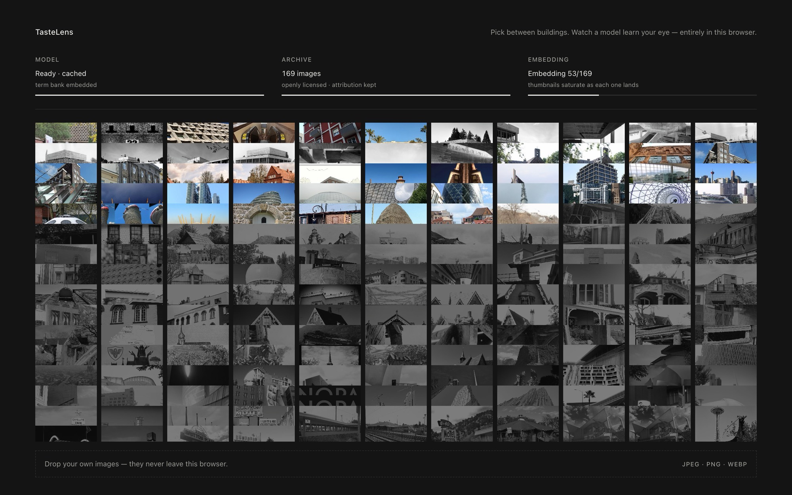

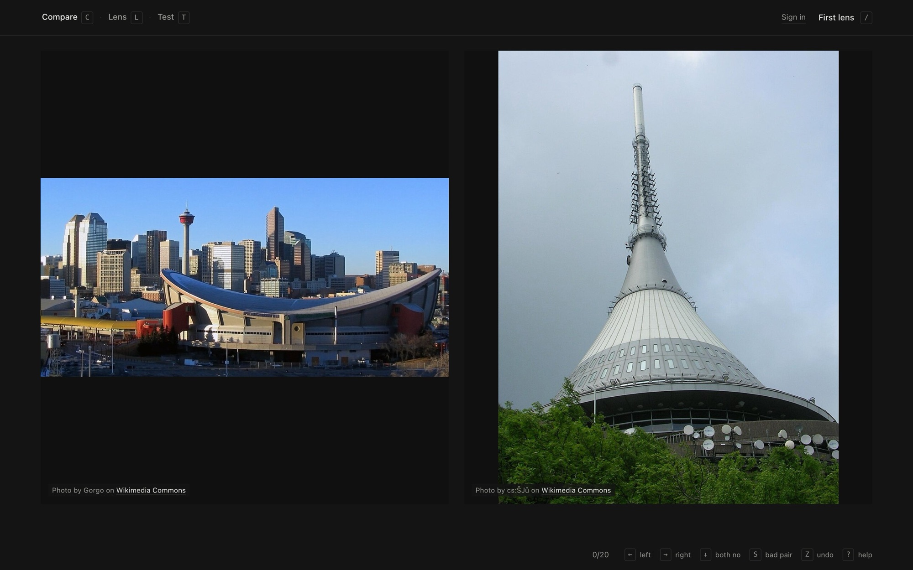
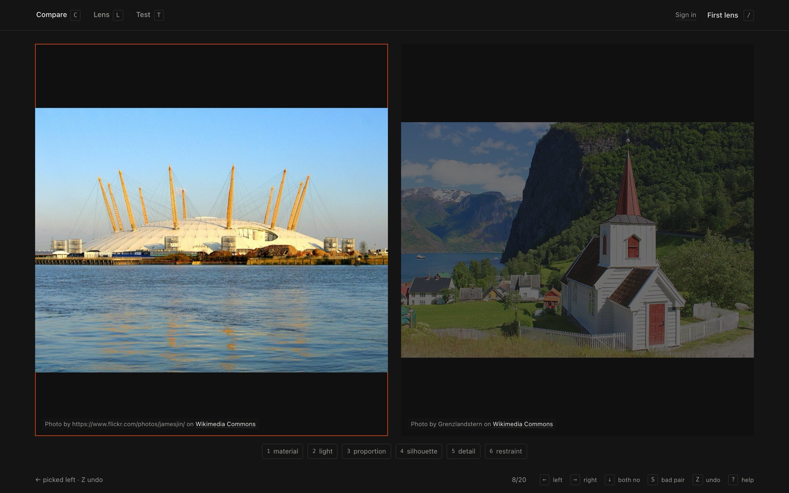

The **Lens** is the model made legible. It shows the terms you're drawn to and averse to, a separate list of photographic qualities (long exposure, overcast sky) so photo style doesn't get mistaken for taste, and strips of the images that are most and least you.

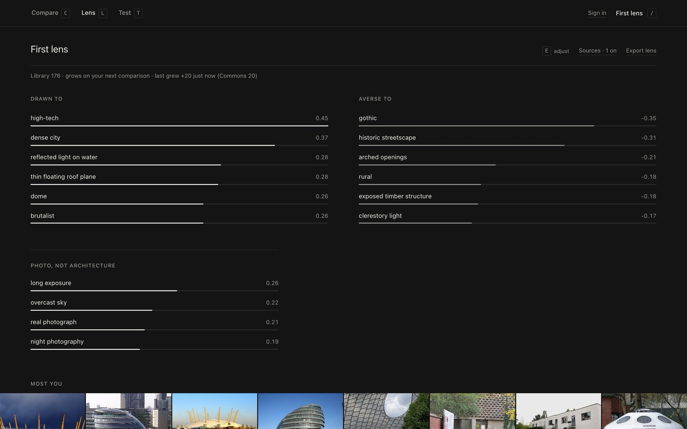

The **Test** screen predicts your pick before you make it. The headline number only counts randomly chosen pairs, because the model's own "most informative" pairs are close to 50/50 by design. My own lens, at 480+ comparisons, was predicting my picks 75% of the time against a self-consistency ceiling of 82%.

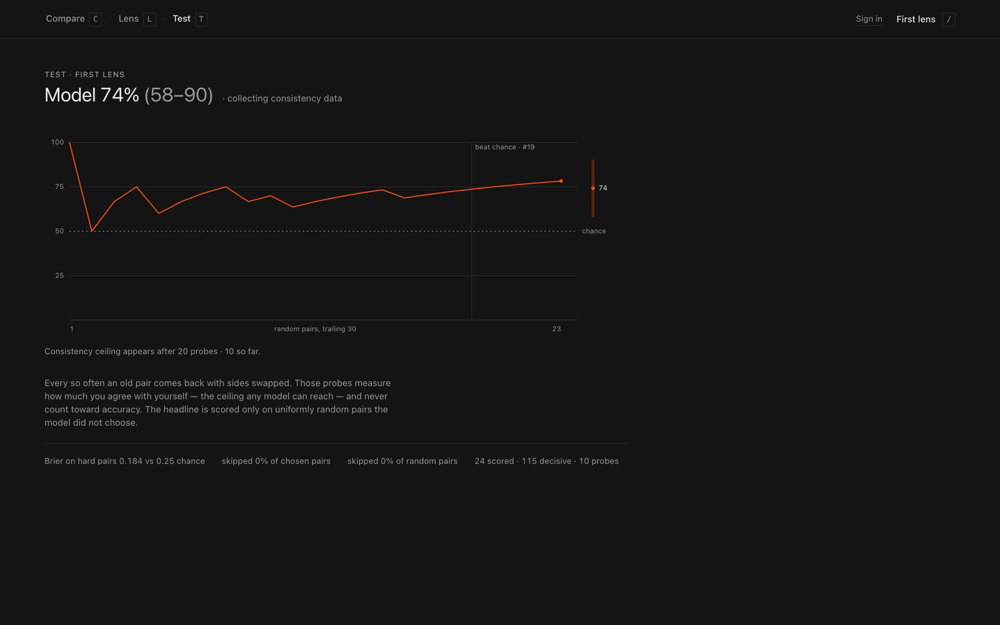

<!-- The screenshots above use a fresh demo lens trained by a script that prefers concrete modernism, not my own lens. Swap in shots of the real one when you like. -->

Accounts and sync went in the same day. The schema is on Supabase with row-level security on every table, and there's a check that runs the migration against an in-memory Postgres to prove users can't see each other's data. It's live at [tastelens-ebon.vercel.app](https://tastelens-ebon.vercel.app/).

## Next

- Turn accounts on for the live TasteLens site. The Vercel build doesn't have the Supabase settings yet, so for now it runs local-only.
- Get CritRPG into git and online.
- Week 3 is business planning: name, problem, who has it, and a website for the pitch.
